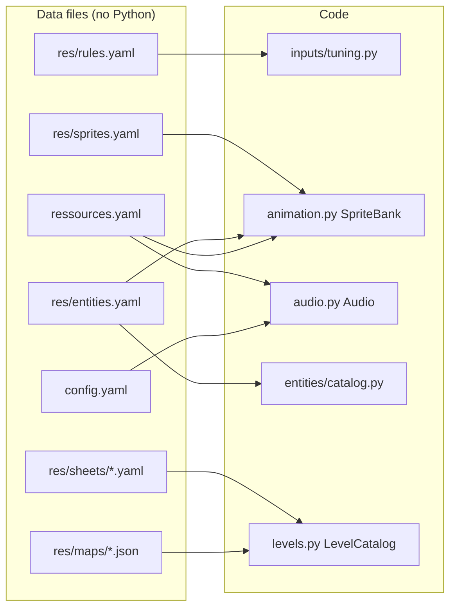
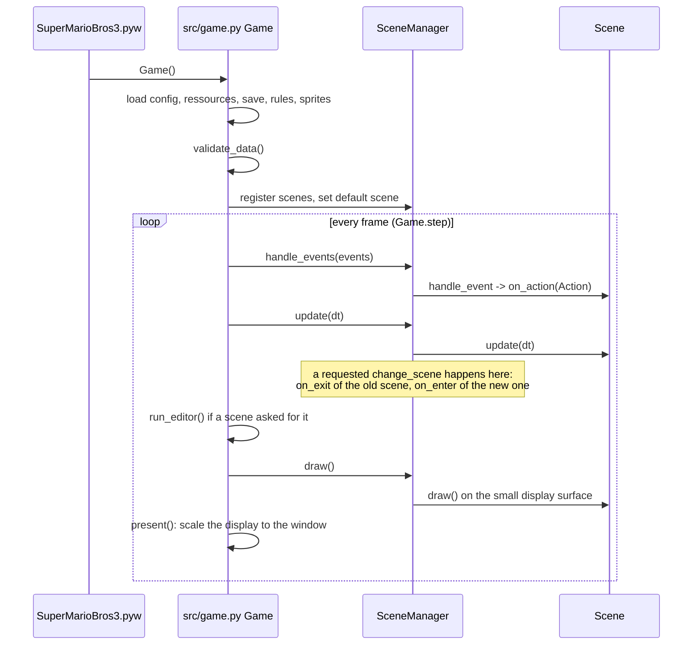
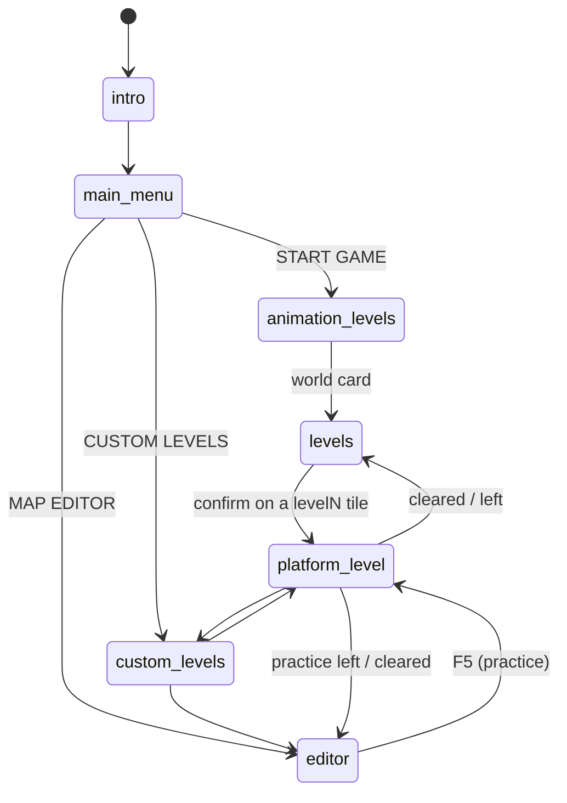
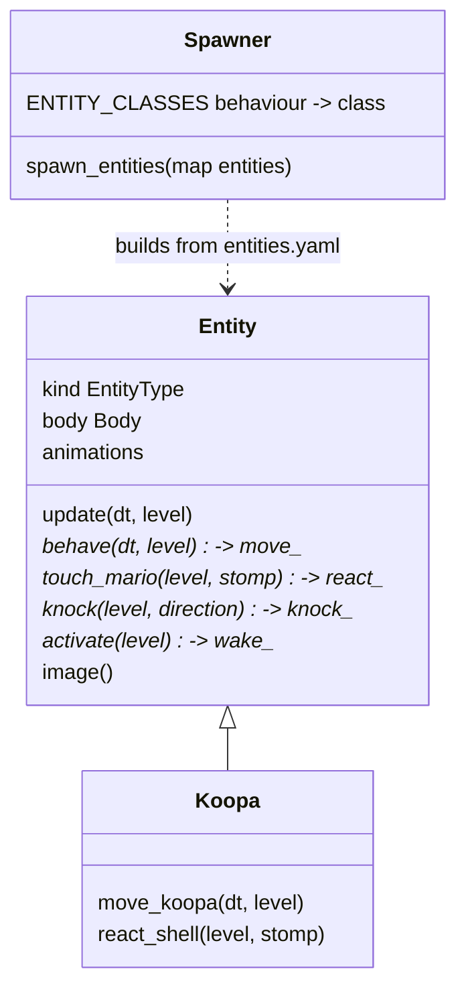
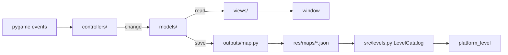

# Architecture

This page explains how the pieces fit together at run time. The
[README](../README.md#code-structure) lists the files, and
[CONTRIBUTING](../CONTRIBUTING.md#project-tour) explains how to extend them.
Every module also starts with a docstring that describes its role.

## The idea: the code knows ids, the data knows the rest

- **Values** (speeds, scores, durations, sky, music) are UPPER_CASE class
  constants. `tune(obj, settings)` (`src/inputs/tuning.py`) replaces them on
  one *instance* from camelCase keys: `walkSpeed` → `WALK_SPEED`. The constant
  in the code is the default; `check(cls, settings)` validates a section
  without an instance. Constants listed in `NOT_TUNABLE` cannot be changed.
- **Pictures** are named animations (`SpriteBank.animation("mario",
  "small_walk")`), cut once from the images of `ressources.yaml`.
- **Sounds** are events (`audio.play("jump")`). `ressources.yaml` maps each
  event to a file, and an event without a file stays silent.
- **Entities** are an id in the map, plus a `behaviour` (a Python class) and
  data in `entities.yaml`.
- **Tiles** have a `behaviour` in their tileset metadata (`coin`, `brick`...).

Everything is checked when the game starts (`validate_data` in `src/game.py`),
so a typo shows up at once with the list of the known names, not in the
middle of a level.

## Start-up and main loop

`Game` is the only place that creates objects (the *composition root*).
Scenes get everything they need through a `GameContext` (config, ressources,
save, font, HUD, maps, levels, rules, sprites, audio, `open_editor`,
`play_level`, `persist_progress`), so tests can build a game with fake files
or a fake editor. `ProgressSession` (`src/progress.py`) owns the active level's
progress: normal play uses the real save and persists it when leaving, while
practice uses a deep copy that is never persisted. The HUD reads this active
session; the real save is also written on shutdown.

## Scenes

A scene reacts to *actions* (`Action.CONFIRM`, `Action.LEFT`...), never to raw
keys: `config.yaml` maps the keys to the actions. `platform_level` is a single
scene that plays any map; `play_level(level, on_finish)` starts it, and
`on_finish(cleared)` decides where to go next.

`LevelEffects` (`src/scenes/level_effects.py`) owns the transient block bumps,
coin pops, score popups and debris, including their animation and drawing.
The level scene still decides when gameplay creates an effect.

## A frame of a platform level

`PlatformLevelScene._update_playing` (`src/scenes/platform_level_scene.py`):

1. `Body.update` moves Mario from the controls and returns the cells his head
   bumped. `bump` then applies their tile behaviour: `question_block` gives a
   coin or wakes a hidden entity, `brick` breaks for big Mario.
2. `_touch_tiles` handles the cells Mario overlaps: `coin`, `hurt`, `goal`.
3. Each entity runs `Entity.update`, a template method: knocked, rising out of
   a block, or `behave()`, which runs its `movement` effect. The level then
   checks the contacts and calls `touch_mario(level, stomp)`, which runs its
   `onStomp` or its `onTouch` effect.
4. Then the timer, the hurry music and the camera.

`MapData.parse` (`src/inputs/map.py`) checks dimensions, collision booleans,
tile codes, entity positions and level settings before creating sprites.
Both `LevelCatalog.info` and `Map` use it; both also check each tile and
replacement against the actual tileset image and metadata. Invalid levels
are shown as unplayable in the catalog instead of failing only on entry.
The catalog also calls `validate_spawns` for per-instance entity settings
written by the editor; `MapData` retains those overrides for the spawner.

Entities never see the scene: they talk to it through the small `Level`
protocol (`mario`, `is_solid`, `hurt_mario`, `stomped`, `score`,
`play_sound`...) in `src/entities/entity.py`, which keeps them testable.

The behaviour itself is data: a setting names the effect to run (`movement`,
`onStomp`, `onTouch`, `onKnock`, `onWake`, `collect`) and `Entity` looks for
the method of that name (`move_walk`, `react_squash`, `knock_hop`...). An
entity whose `behaviour` is `generic` therefore needs no Python: the goomba
and the mushrooms are only `entities.yaml`. A class is added for a real state
machine only, like the shell of the `koopa`. `validate_entity_types` checks
every name when the game starts, with the list of the effects of the class.

`red_koopa` shows why this matters: it is a `koopa` behaviour with a
`palette` swap and `turnAtLedges: true`, written only in `entities.yaml`.

## The map editor

The editor (`map_editor/`) is a separate model / view / controller program
that the game runs in the same window:

- **Models** hold the data and have no drawing code: the map and its undo
  history (`MapEditorModel`), the tool settings (`EditorState`), the tileset,
  the clipboard, the entity types, the selected entity's settings panel
  (`EntityPanel`), the level settings and the launcher.
- **Views** only draw the models: camera, map, sidebar, status bar.
- **Controllers** turn events into model changes.
- `src/editor_bridge.py` (`EditorSession`) is the link with the game.
  `Game.run_editor` stops the game loop and runs the launcher or the paused
  map. It gets back an `EditorResult`: quit, go back, or play a map. The map
  is played in *practice* mode, and leaving it goes back to the editor.

The editor reads the same data as the game (`ressources.yaml`,
`res/entities.yaml`, `res/sheets/*.yaml`), so a new entity or tile behaviour
shows up in both.

An entity on the map is a `Placement` (type id plus optional per-instance
`settings`). `Alt` + click selects one for the in-window panel; each change
is an undoable map edit. Only scalar settings declared on its type are listed.
Saving writes the overrides into that entity's JSON entry; copying or rotating
a block keeps them. `LevelCatalog` validates the overrides (including effects
and required animations) before marking the map playable, and
`spawn_entities` merges them with that type's settings without changing the
shared type.

## Tests

`tests/` drives the real code with the dummy SDL drivers (no window, no
sound card):

- `test_architecture.py`: config, map/catalog consistency, level effects and
  practice versus saved progression.

`Audio.history` records the sound events, so tests can check that `jump` was
played without hearing it.
